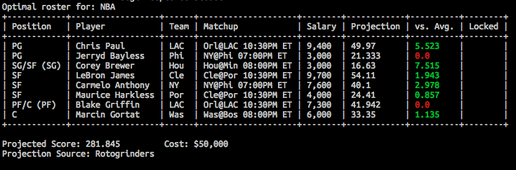

## Introduction &middot; [](https://travis-ci.org/BenBrostoff/draft-kings-fun) &middot; [](https://draftfast.herokuapp.com/) &middot; [](https://www.patreon.com/user?u=8965834)



This is an incredibly powerful tool that can automate lineup building, allowing you to enter thousands of lineups in any DK contest in the time it takes you to grab a coffee. Works for NFL, NBA, WNBA and MLB on either DraftKings or FanDuel.

This project allows you to create an unlimited amount of optimized DraftKings lineups based on any projection source of your choice. You can use this repo as a command line application, or import functionality as needed to build your own scripts to construct thousands of DraftKings lineups each week and upload them in seconds using their [CSV upload tool](https://www.draftkings.com/lineup/upload). Examples of how to do the latter are provided in the `examples` directory.

Special thanks to [swanson](https://github.com/swanson/), who authored [this repo](https://github.com/swanson/degenerate), which mine is heavily based off of.

Pre-reqs:

* Python 2 but NOT Python 3 compatible yet (currently working on implementation)
* [ortools](https://developers.google.com/optimization/installing?hl=en)
* `pip install -r requirements.txt`

To run, download your desired week's salaries on DraftKings, and then run:

```
bash scripts/prepare_nfl_contest_data.sh
```

Note that this script will error out if the CSV from DraftKings is not in `~/Downloads`.

To run the optimizer, you must provide a projection CSV with `playername` and `points` fields. Run the optimizer with your projection file:

```
python optimize.py -mp 100 -projection_file "./data/my_projections.csv"
```

Switching to FanDuel is simple - just change the `salaries_file` and `game` flags.

```
python optimize.py -mp 100 -game fanduel -projection_file "./data/my_projections.csv" -salaries_file "./data/fanduel_salaries.csv"
```

Note that the default file location for the projection file is `./data/current-projections.csv`, so if you have the file in the default location with the correct name, there's no need to pass the `projection_file` flag. The same is true with `./data/current-salaries.csv` and `salaries_file`.

## Optimization Options

Force a QB/WR or QB/TE combination from a particular team. For instance, if I wanted a guaranteed Cam Newton / Greg Olsen duo:

```
python optimize.py -mp 100 -duo CAR -dtype TE
```

Another example pairing Antonio Brown and Ben Roethlisberger:

```
python optimize.py -mp 100 -duo PIT -dtype WR
```

Limit same team representation except for QB / skill player combos. Example:

```
python optimize.py -mp 100 -limit y
```

Run the optimizer multiple times and continually eliminate pre-optimized players from the lineup. For instance, to run three different iterations and generate three different sets of players:

```
python optimize.py -i 3
```

At any time, you can get a list of all possible options via:

```
python optimize.py --help
```

## Generating CSV for uploading multiple lineups to DraftKings

DraftKings allows uploading up to 500 lineups using a single CSV file. [You can learn more about DraftKings' support for lineup uploads here.](https://playbook.draftkings.com/news/draftkings-lineup-upload-tool) This tool supports
generating an uploadable CSV file containing the generated optimized lineups.

To use this feature:

1. Download the weekly salaries CSV from DraftKings
(containing player name, DK-estimated points, salary, etc).
2. Run `bash scripts/prepare_<nba/nfl>_contest_data.sh`.
3. Download the [CSV upload template](https://www.draftkings.com/lineup/upload) and get the file location (probably something like `~/Downloads/DKSalaries.csv`). *Note - this file has the same name as the weekly salaries CSV when downloaded from DraftKings, which can be confusing.*
4. Run `python optimize.py -pids <upload_tpl_location>`. Remember to specify league, constraints, number of iterations to run, etc.
5. Upload the newly generated file to DraftKings from `data/current-upload.csv`.

One nice workflow is to run the optimizer with the `-keep_pids` flag after you create your CSV; this option will put future optimizations in the same CSV file.

## NBA

```
python optimize.py -l NBA
```

## WNBA

```
python optimize.py -l WNBA
```

## MLB

```
python optimize.py -l MLB
```
