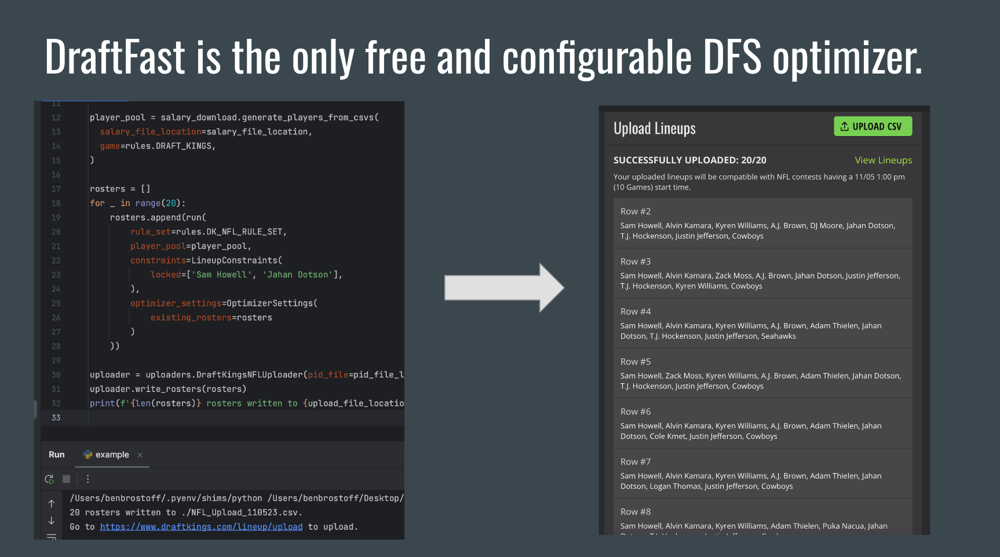
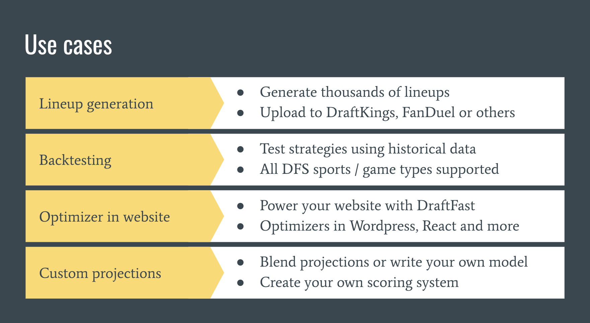

## Introduction &middot; [](https://github.com/BenBrostoff/draftfast/actions/workflows/main.yml)  &middot; [](https://draftfast.herokuapp.com/)




An incredibly powerful tool that automates and optimizes lineup building, allowing you to enter thousands of lineups in any DraftKings or FanDuel contest in the time it takes you to grab a coffee.

## Installation

Requires Python 3.12+.

```bash
pip install draftfast
```

## Usage

Example usage ([you can experiment with these examples in repl.it](https://repl.it/@BenBrostoff/AllWarlikeDemoware)):

```python
from draftfast import rules
from draftfast.optimize import run
from draftfast.orm import Player
from draftfast.csv_parse import salary_download

# Create players for a classic DraftKings game
player_pool = [
    Player(name='A1', cost=5500, proj=55, pos='PG'),
    Player(name='A2', cost=5500, proj=55, pos='PG'),
    Player(name='A3', cost=5500, proj=55, pos='SG'),
    Player(name='A4', cost=5500, proj=55, pos='SG'),
    Player(name='A5', cost=5500, proj=55, pos='SF'),
    Player(name='A6', cost=5500, proj=55, pos='SF'),
    Player(name='A7', cost=5500, proj=55, pos='PF'),
    Player(name='A8', cost=5500, proj=55, pos='PF'),
    Player(name='A9', cost=5500, proj=55, pos='C'),
    Player(name='A10', cost=5500, proj=55, pos='C'),
]

roster = run(
    rule_set=rules.DK_NBA_RULE_SET,
    player_pool=player_pool,
    verbose=True,
)

# Or, alternatively, generate players from a CSV
players = salary_download.generate_players_from_csvs(
  salary_file_location='./salaries.csv',
  game=rules.DRAFT_KINGS,
)

roster = run(
  rule_set=rules.DK_NBA_RULE_SET,
  player_pool=players,
  verbose=True,
)
```

You can see more examples in the [`examples` directory](https://github.com/BenBrostoff/draftfast/tree/master/examples).

## Game Rules

Optimizing for a particular game is as easy as setting the `RuleSet` (see the example above). Game rules in the library are in the table below:

| League       | Site           | Reference  |
| ------------- |:-------------:| :-----:|
| NFL | DraftKings | `DK_NFL_RULE_SET` |
| NFL | FanDuel | `FD_NFL_RULE_SET` |
| NBA | DraftKings | `DK_NBA_RULE_SET` |
| NBA | FanDuel | `FD_NBA_RULE_SET` |
| MLB | DraftKings | `DK_MLB_RULE_SET` |
| MLB | FanDuel | `FD_MLB_RULE_SET` |
| WNBA | DraftKings | `DK_WNBA_RULE_SET` |
| WNBA | FanDuel | `FD_WNBA_RULE_SET` |
| PGA | FanDuel | `FD_PGA_RULE_SET` |
| PGA | DraftKings | `DK_PGA_RULE_SET` |
| PGA_CAPTAIN | DraftKings | `DK_PGA_CAPTAIN_RULE_SET` |
| NASCAR | FanDuel | `FD_NASCAR_RULE_SET` |
| NASCAR | DraftKings | `DK_NASCAR_RULE_SET` |
| SOCCER | DraftKings | `DK_SOCCER_RULE_SET` |
| EuroLeague | DraftKings | `DK_EURO_LEAGUE_RULE_SET` |
| NHL | DraftKings | `DK_NHL_RULE_SET` |
| NBA Pickem | DraftKings | `DK_NBA_PICKEM_RULE_SET` |
| NFL Showdown | DraftKings | `DK_NFL_SHOWDOWN_RULE_SET` |
| NBA Showdown | DraftKings | `DK_NBA_SHOWDOWN_RULE_SET` |
| MLB Showdown | DraftKings | `DK_MLB_SHOWDOWN_RULE_SET` |
| XFL | DraftKings | `DK_XFL_CLASSIC_RULE_SET` |
| Tennis | DraftKings | `DK_TEN_CLASSIC_RULE_SET` |
| CS:GO | DraftKings | `DK_CSGO_SHOWDOWN` |
| F1 | DraftKings | `DK_F1_SHOWDOWN` |
| NFL MVP | FanDuel | `FD_NFL_MVP_RULE_SET` |
| MLB MVP | FanDuel | `FD_MLB_MVP_RULE_SET` |
| NBA MVP | FanDuel | `FD_NBA_MVP_RULE_SET` |

Note that you can also tune `draftfast` for any game of your choice even if it's not implemented in the library (PRs welcome!). Using the `RuleSet` class, you can generate your own game rules that specific number of players, salary, etc. Example:

```python
from draftfast import rules

golf_rules = rules.RuleSet(
    site=rules.DRAFT_KINGS,
    league='PGA',
    roster_size='6',
    position_limits=[['G', 6, 6]],
    salary_max=50_000,
)
```

## Settings

Usage example:

```python
class Showdown(Roster):
    POSITION_ORDER = {
        'M': 0,
        'F': 1,
        'D': 2,
        'GK': 3,
    }


showdown_limits = [
    ['M', 0, 6],
    ['F', 0, 6],
    ['D', 0, 6],
    ['GK', 0, 6],
]

soccer_rules = rules.RuleSet(
    site=rules.DRAFT_KINGS,
    league='SOCCER_SHOWDOWN',
    roster_size=6,
    position_limits=showdown_limits,
    salary_max=50_000,
    general_position_limits=[],
)
player_pool = salary_download.generate_players_from_csvs(
    salary_file_location=salary_file,
    game=rules.DRAFT_KINGS,
)
roster = run(
    rule_set=soccer_rules,
    player_pool=player_pool,
    verbose=True,
    roster_gen=Showdown,
)
```

`PlayerPoolSettings`

- `min_proj`
- `max_proj`
- `min_salary`
- `max_salary`
- `min_avg`
- `max_avg`

`OptimizerSettings`

- `stacks` - A list of `Stack` objects. Example:

```python
roster = run(
    rule_set=rules.DK_NHL_RULE_SET,
    player_pool=player_pool,
    verbose=True,
    optimizer_settings=OptimizerSettings(
        stacks=[
            Stack(team='PHI', count=3),
            Stack(team='FLA', count=3),
            Stack(team='NSH', count=2),
        ]
    ),
)
```

`Stack` can also be tuned to support different combinations of positions. For NFL,
to only specify a QB-WRs based stack of five:

```python
Stack(
    team='NE',
    count=5,
    stack_lock_pos=['QB'],
    stack_eligible_pos=['WR'],
)
```

- `custom_rules` - Define rules that set if / then conditions for lineups.


For example, if two WRs from the same team are in a naturally optimized lineup, then the QB must also be in the lineup. You can find some good examples of rules in `draftfast/test/test_custom_rules.py`.

```python
from draftfast.optimize import run
from draftfast.settings import OptimizerSettings, CustomRule

# If two WRs on one team, play the QB from same team
settings = OptimizerSettings(
    custom_rules=[
        CustomRule(
            group_a=lambda p: p.pos == 'WR' and p.team == 'Patriots',
            group_b=lambda p: p.pos == 'QB' and p.team == 'Patriots',
            comparison=lambda sum, a, b: sum(a) + 1 <= sum(b)
        )
    ]
)
roster = run(
    rule_set=rules.DK_NFL_RULE_SET,
    player_pool=nfl_pool,
    verbose=True,
    optimizer_settings=settings,
)
```

Another common use case is given one player is in a lineup, always play another player:

```python
from draftfast.optimize import run
from draftfast.settings import OptimizerSettings, CustomRule

# If Player A, always play Player B and vice versa
settings = OptimizerSettings(
    custom_rules=[
        CustomRule(
            group_a=lambda p: p.name == 'Tom Brady',
            group_b=lambda p: p.name == 'Rob Gronkowski',
            comparison=lambda sum, a, b: sum(a) == sum(b)
        )
    ]
)
roster = run(
    rule_set=rules.DK_NFL_RULE_SET,
    player_pool=nfl_pool,
    verbose=True,
    optimizer_settings=settings,
)
```

Custom rules also don't have to make a comparison between two groups. You can say "never play these two players in the same lineup" by using the `CustomRule#comparison` property.

```python
# Never play these two players together
settings = OptimizerSettings(
    custom_rules=[
        CustomRule(
            group_a=lambda p: p,
            group_b=lambda p: p.name == 'Devon Booker' or p.name == 'Chris Paul',
            comparison=lambda sum, a, b: sum(b) <= 1
        )
    ]
)
roster = run(
    rule_set=rules.DK_NBA_RULE_SET,
    player_pool=nba_pool,
    verbose=True,
    optimizer_settings=settings,
)
```

Importantly, as of this writing, passing closures into `CustomRule`s does not work (ex. `lambda p: p.team == team`),
so dynamically generating rules is not possible. PRs welcome for a fix here, I believe this is a limitation of `ortools`.

`LineupConstraints`

- `locked` - list of players to lock
- `banned` - list of players to ban
- `groups` - list of player groups constraints. See below

```python
roster = run(
    rule_set=rules.DK_NFL_RULE_SET,
    player_pool=player_pool,
    verbose=True,
    constraints=LineupConstraints(
        locked=['Rob Gronkowski'],
        banned=['Mark Ingram', 'Doug Martin'],
        groups=[
            [('Todd Gurley', 'Melvin Gordon', 'Christian McCaffrey'), (2, 3)],
            [('Chris Carson', 'Mike Davis'), 1],
        ]
    )
)
```

- `no_offense_against_defense` - Do not allow offensive players to be matched up against defensive players in the optimized lineup. Currently only implemented for soccer, NHL, and NFL -- PRs welcome!

## CSV Upload

```python
from draftfast.csv_parse import uploaders

uploader = uploaders.DraftKingsNBAUploader(
    pid_file='./pid_file.csv',
)
uploader.write_rosters(rosters)

```

## Support and Consulting

DFS optimization is only one part of a sustainable strategy. Long-term DFS winners have the best:

- Player projections
- Bankroll management
- Diversification in contests played
- Diversification across lineups (see `draftfast.exposure`)
- Research process
- 1 hour before gametime lineup changes
- ...and so much more

DraftFast provides support and consulting services that can help with all of these. [Let's get in touch today](mailto:ben.brostoff@gmail.com).

# Contributing

Run tests or set of tests:

```sh
# All tests
nose2

# Single file
nose2 draftfast.test.test_soccer

# Single test
nosetests draftfast.test.test_soccer.test_soccer_dk_no_opp_d
```

Run linting

```
flake8 draftfast
```

# Credits

Special thanks to [swanson](https://github.com/swanson/), who authored [this repo](https://github.com/swanson/degenerate), which was the inspiration for this one.

Current project maintainers:

- [BenBrostoff](https://github.com/BenBrostoff)
- [sharkiteuthis](https://github.com/sharkiteuthis)
